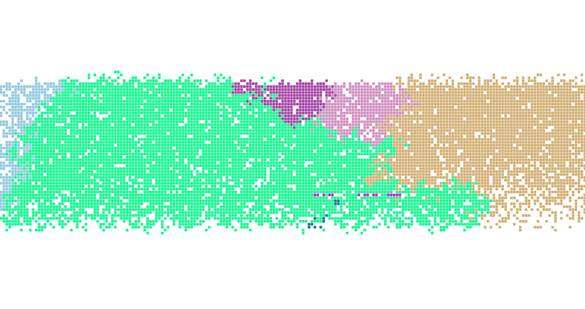
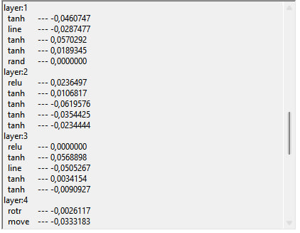

# 🧬 Neural Network–Driven Evolution Simulation

**Independent project** exploring how neural networks can evolve and adapt in fast-paced environment.
Developed in **C# (WinForms)** from scratch as an experiment in evolutionary computation and agent-based modeling.

---

## 🧠 Overview

This project simulates a 2D environment populated by **autonomous agents**.
Each organism is represented as a colored cell and is controlled by an **artificial neural network** that serves as its “brain.”
Organisms interact with their surroundings — moving, photosynthesizing, attacking others, reproduce, consuming organic matter, etc.
Through **mutations and natural selection**, more adaptive neural architectures gradually evolve over generations.

The aim is to observe **emergent behavior**, survival strategies, and how complex intelligence can arise from simple rules and mutation-driven evolution.

---

## 🌍 Simulation Mechanics

- **Environment:** Discrete 2D grid cellular field
- **Agents:** Each organism has parameters like energy, age, color, and neural network structure
- **Actions:** Move, photosynthesize, bite, consume organic matter, reproduce
- **Neural Network:** Defines decision-making; number of layers, neurons, and weights can mutate
- **Evolution:** Agents with higher fitness reproduce more often, passing slightly mutated networks to offspring

---

## 🧩 Features

- Custom-built neural network system (no external ML libraries)
- Adjustable simulation parameters (mutation rate, resources amount, etc.)
- Different rendering modes(organics, species, etc.)
- Ability to view the structure of neural network
- User-friendly UI for pausing, observing, and tweaking parameters on the fly

---

## 🖼️ Screenshots

| Simulation Overview | Neural Activity |
|----------------------|-----------------|
|  |  |

---

## 🎥 Demo

---

## ⚙️ Tech Stack

- **Language:** C#
- **Framework:** WinForms
- **Paradigm:** Object-Oriented Programming
- **Concepts:** Neural Networks, Genetic Algorithms, Artificial Life
---

## 🏆 Recognition

- Presented at regional student project competition — **3rd Place Award**  
- Demonstrated at local science and technology events  
- Developed independently as part of personal research on artificial evolution

---

## 🔬 Future Improvements

- Implement speciation and cross-breeding
- Add visualization of neural network
- Introduce environmental variability (e.g., resource zones, temperature)
- Export and analyze long-term population data for research

---

## ⚙️ How to Run

To launch the project locally:

1. Install .NET Framework and ensure C# is supported on your system.

2. Clone the repository:

3. git clone https://github.com/Junk02/SimulationEvolution

4. Open the solution file (.sln) in Visual Studio (or any IDE that supports C# and WinForms).

5. Build and run the project — the simulation window will appear automatically.
